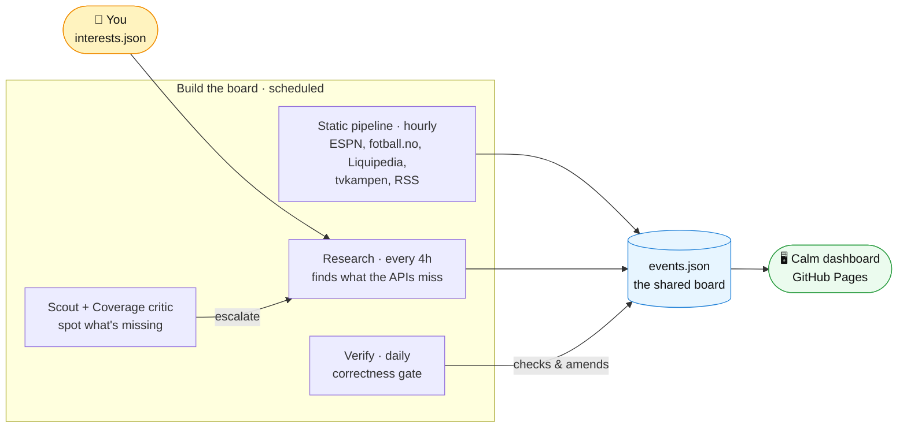

# Sportivista

> A **calm, personal overview** of the sport, esport and tournaments you follow — one
> quiet place that answers *what's on · when · where to watch · what's live now* — where
> **scheduled AI research agents** find and **verify** the events static APIs miss.

[](https://github.com/CHaerem/sportivista/actions)
[](https://sportivista.com/)

**See it live**: [sportivista.com](https://sportivista.com/)

<!-- STATUS:START -->
## AI-budsjett

Kvoten er **konto-bred** (delt med interaktiv Claude-bruk) — samlet kvote-trykk, ikke per-agent.

| Vindu | Brukt | Detaljer |
|---|---|---|
| Uke (7d) | **100%** 🔴 | ↑ +16pp siste 24t · nullstilles 2026-07-27 |
| Sesjon (5t) | 5% | nullstilles 19:10 UTC |
| Siste 7 dager | topp 100% · snitt 59% | 27t i sparemodus |

<sub>Oppdatert 2026-07-24 16:59 UTC av `usage-monitor` · kilde: `docs/data/usage-summary.json` · [Self-throttling on quota](#self-throttling-on-quota)</sub>
<!-- STATUS:END -->

## What it is

One calm place that gathers everything you follow — sport, esport, tournaments — and
answers only what matters: **what's on, when, where to watch, and what's live now.**
No noisy feed competing for your attention; one quiet, scannable overview.

The core promise is **trust**: times and where-to-watch are meant to be *correct and
dependable*, and the app should never miss what matters to you. That's why AI research
runs actively — searching broad static and live sources, finding events ordinary APIs
miss, and **verifying** when and where before anything reaches you.

You describe your interests in plain language — *"Cycling in summer, especially the
Tour de France, focused on the Norwegian riders and Uno-X"* — and an in-app assistant
lets you ask questions and reshape the overview anytime. What you follow lives on your
own device, never on a server.

## The idea

Sports APIs cover the big leagues. They miss most of what a Norwegian fan cares about:
biathlon world cups, Norway Chess, cross-country skiing, cycling stage races, Norwegian
Cup football, last-minute schedule changes. v1 of this project tried to close that gap
with an elaborate self-improving autonomy architecture (13 feedback loops, a nightly
multi-agent autopilot, 2000+ tests). It proved the concept — and produced stagnating
quality at high complexity.

**v2 bets on the model instead of the machinery**: nine scheduled Claude agents —
research, verify, editorial, scout, a coverage critic, a vision-based visual QA, a
UI-fix agent that self-heals rendering bugs (fix → verify → auto-merge), a
self-repair "mechanic" that fixes its own broken code/tests, and a weekly improve
agent that evolves its own behavior — do real research, write transparent JSON,
and explain their reasoning. The self-fixing loops auto-merge their own verified
changes (test-gated), stopping short only at five protected paths (workflows,
composite actions, hooks, hook wiring, your interests file). Every loop is narrow
and test-gated — the deliberate opposite of v1's sprawling autopilot.

## Architecture

Everything runs on **GitHub Actions + Claude Code Max + GitHub Pages**. No servers,
no databases, no paid APIs.



**Reading it, left to right:** you own `interests.json`; the hourly static pipeline and
the every-4h research agent both write the shared board (`events.json`) — scout and the
coverage critic point research at what's missing, and verify corrects it — and the board
publishes to the calm dashboard. Two support systems aren't drawn here (they keep the
system healthy without touching this flow): the **self-maintenance loops** (visual-QA →
UI-fix, self-repair, improve) and the **quota governor** that gates every agent. All
eleven scheduled jobs, with their models, are in the table below.

### The scheduled jobs

| Job | When | Model | What it does |
|---|---|---|---|
| **Static pipeline** | hourly | — | Fetch ESPN · fotball.no · Liquipedia CS2 · tvkampen · RSS → `events.json`; auto-publish to Pages on change |
| **Research** | every 4h | Opus (deep runs: Fable 5) | Find events the APIs miss; append to `events.json`, rewrite `tracked.json` with a reason per entry |
| **Scout** | hourly | Haiku | Triage RSS + coverage gaps → escalate to research (max 2/day) |
| **Coverage critic** | daily | Opus | Audit what's missing — an imminent pass + a 4-week horizon, trusting no single source |
| **Verify** | daily | Opus | Re-check events against the web; log the calibration ledger + source-quirks |
| **Editorial** | 2×/day | Opus | Morning/evening brief → `featured.json` |
| **Visual QA** | daily | Sonnet | Screenshot the dashboard and *look* → flag truncation/overflow/calm-design |
| **UI-fix** | daily | Opus | Fix the frontend from QA findings → re-screenshot + test → auto-merge |
| **Self-repair** | daily | Opus | Fix broken runs/tests/fetchers → auto-merge |
| **Improve** | weekly | Opus | Mine the logs for one evidenced improvement → auto-merge |
| **Usage monitor** | hourly | — | Real account-wide quota gauge; gates every agent |

The self-fixing loops (UI-fix, self-repair, improve) auto-merge behind a re-run test
gate (one shared enforcement, `scripts/merge-gate.js`), stopping only at five
**protected paths** that always wait for review: `.github/workflows/**`,
`.github/actions/**`, `scripts/hooks/**`, `scripts/config/interests.json`, and
`.claude/settings.json`.

### Correct "where to watch"

Getting the time and channel right is the whole point. Every followed event
resolves to a **Norwegian** channel (never FOX/ESPN): football matches match
against real [tvkampen.com](https://www.tvkampen.com) TV listings, with a
deterministic Norwegian-rights map (`scripts/lib/norwegian-rights.js`) as the
fallback. When the exact broadcaster isn't yet known (e.g. a World Cup match days
out), the UI shows one honest tentative `NRK / TV 2` label rather than guessing.

### Self-throttling on quota

Claude Code Max quota is finite and shared with interactive use, so the agents
watch it. A `usage-monitor` reads real account-wide usage — a minimal
`/v1/messages` call returns the `anthropic-ratelimit-unified-*` headers (5h + 7d
utilization + reset times) — writes `usage-state.json`, keeps an append-only
`usage-history.jsonl`, and rolls it into the trend shown in the **AI-budsjett**
block at the top of this README. Every agent gates on it: critical ones (research,
verify, scout) run unless the budget is nearly gone; nice-to-haves (editorial,
coverage-critic, visual-qa) step aside first when it runs low. Research runs on a
tiered model: the every-4h workhorse is Opus 4.8 (the `standard` tier), and only the
heavier `deep` runs — escalations and the weekly sweep — prefer Fable 5, auto-falling
back to Opus 4.8 if Fable is unavailable. The dashboard shows a quiet "AI-budsjett"
line too. Fail-open by design — the governor throttles only on fresh, confident quota
data.

### Transparent tracking

- **`scripts/config/catalog.json`** — the server's coverage compass: what Sportivista
  *covers* (broad tier-1 sports + a named tier-2 long tail), AI-managed and published
  read-only as "Dette dekker vi". Personal precision lives only in each client's
  on-device lens — the server never knows what any one person follows.
- **`scripts/config/interests.json`** — the owner's private profile (and catalog seed).
  The human's file; AI never touches it, and since the multi-user split it is no
  longer published.
- **`scripts/config/tracked.json`** — what the AI currently tracks. Every entry carries
  `reason`, `addedBy`, `evidence`, and an optional `expires` — inspectable on the
  dashboard under *"Hva vi følger"*.
- Every AI-researched event carries `confidence` (high requires 2+ source URLs) and an
  **AI badge** in the UI that opens the evidence.

### Portability

Vendor lock-in is confined to the nine agent workflow files
(`.github/workflows/*-agent.yml`, using `anthropics/claude-code-action@v1`). The
prompts in `scripts/agents/*.md` are capability-described — swap the AI provider by
replacing workflow YAML only.

## Frontend

Static PWA, no build step. **Calm design** on the Apple-native baseline (DESIGN.md) —
the system font, amber as the single accent, a true-black page; no dashboard grid,
no competing panels. A single day-grouped agenda where every row
answers only **when · what · where to watch**, with always-Norwegian channels.
Must-see events (favorite / Norwegian / high importance) get
the gentlest possible accent; details (standings, results, AI sources) are a tap away,
never in your face. True-black dark default with an Apple grouped-light mode that follows the
system theme, live ESPN score polling (60s), one quiet editorial headline on top, tuned
to fit iPhone widths, installable on iOS/Android.

## Development

```bash
npm ci
npm run build      # fetch data + build events + calendar
npm run dev        # localhost:8000
npm test           # 43 focused test files (~600 tests), a few seconds
npm run screenshot # Playwright visual check
```

CI/CD: every PR is gated by `web-tests` (the npm suite) and `ios-tests`
(the Swift suite on a free macOS runner — it skips itself when `ios/` is
untouched). The self-fixing loops re-run tests *and* wait for these checks
before auto-merging. TestFlight builds ship through `ios-release.yml`
(one command: archive → cloud-sign → upload → record), with App Store
Connect as the build-number source of truth.

See [CLAUDE.md](CLAUDE.md) for the full architecture reference.

## iOS app

`ios/` holds a native SwiftUI companion app (agenda + home-screen widget,
on-device Foundation Models assistant that edits your interests, answers
questions and runs app commands in Norwegian — all local, no accounts). It
consumes the same published data contract (`manifest.json`-driven sync), is
verified by its own test suite (500+ unit tests, UI flows, and a versioned
real-model eval corpus), and ships to **TestFlight** through the scripted
release lane. See [ios/README.md](ios/README.md).

## Android & the honest limits

A few deliberate constraints, stated plainly rather than discovered later:

- **Android is not built.** The web PWA is the de-facto Android client today —
  it carries the full personal feed, but **without push notifications and
  without a widget** (the platform APIs the calm-notification story relies on
  are iOS-only in this codebase). A native Android app is a Phase 3 decision,
  not an accident of neglect.
- **Live scores on web poll ESPN's unofficial API from each visitor's
  browser.** Fine at dogfood scale, not a foundation for growth — moving that
  polling behind our own edge is part of the Phase 1 server-layer work
  (WP-21), which is sequenced **before** any user-acquisition push.
- **GitHub Pages hosts the data for free** — which also means its terms cap
  what this can become while it lives there (no commercial hosting). The
  migration path (Workers + R2, same static JSON contract) is designed and
  gated ahead of launch (WP-20/21 before WP-25 in PLAN.md).

### Notifications: what we do, and what we deliberately don't

**Sportivista does not send live goal alerts. That is a choice, not a gap.**

What the app *does* send, all of it computed on your own device:

- **Påminnelse før start** — a reminder ahead of a must-see event, at the lead
  time you choose (default 30 minutes). If the kickoff moves, the reminder moves
  with it.
- **Fulltidsvarsel** — one calm notification when a contest you follow is over
  («Fulltid: Lyn – Sogndal · 2–1»). **Off by default and opted in per team or
  athlete**, from that follow's own page — never a blanket switch. One per
  finished match, never per goal. If you have spoiler protection on that team,
  the notification says only that the result is ready; the score stays behind
  your «Vis resultat» shield.
- **Widget** — the next must-see event, plus the last result, on the home screen
  and (since WP-176) on the lock screen / StandBy.

What we don't send, and why:

- **No live goal or in-play alerts.** Real-time push needs a server holding a
  register of device tokens, pinging Apple's push service the moment something
  happens. Sportivista has no server — the whole system is GitHub Actions +
  GitHub Pages — and a scheduled job could realistically deliver a "goal" 15–60
  minutes late. A goal alert that arrives 40 minutes after the goal is worse
  than no alert: it teaches you to distrust everything else the app tells you.
  We would rather be quiet and right.
- **No device-token register, ever.** Push would mean us holding an identifier
  for your phone on our side. Today the promise is absolute and easy to verify:
  **your profile, your follows and your notifications never touch our servers**,
  because there are none. That is trust capital you spend once. A goal alert is
  not worth it.
- **No Live Activities.** A Live Activity that can't be updated in real time is
  a stale rectangle on your lock screen — the same honesty problem, with more
  machinery.

The one caveat we state plainly rather than paper over: a fulltidsvarsel arrives
**when iOS next lets the app look** (background refresh is granted on the
system's terms, with a floor of a few hours), typically within a few hours of
full time — never live. The app says this in the same place you turn the
notification on.

If you want the goal in the second it happens, keep a live-score app for that.
Sportivista competes on a calm, correct agenda — knowing *what is on, when, and
where to watch it* — not on being the fastest buzz in your pocket.

## License

MIT License
